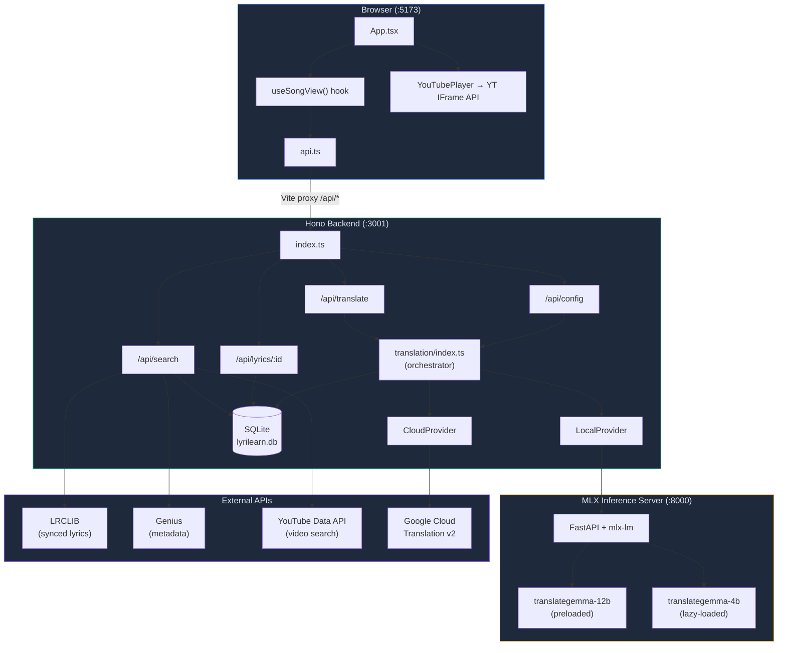
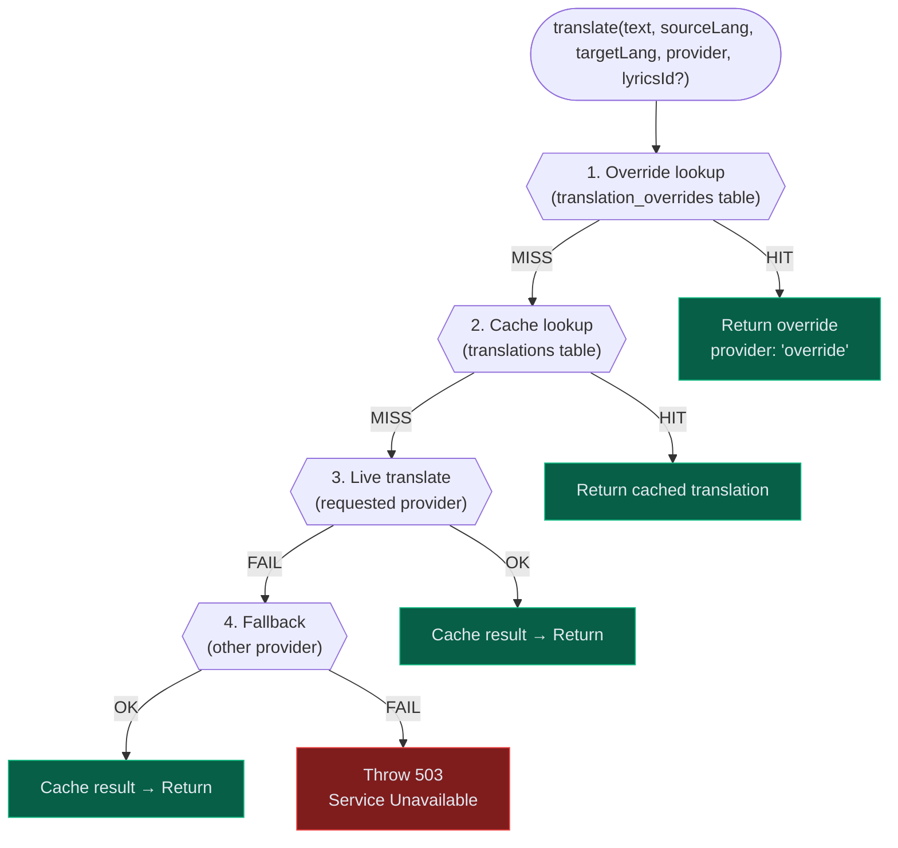
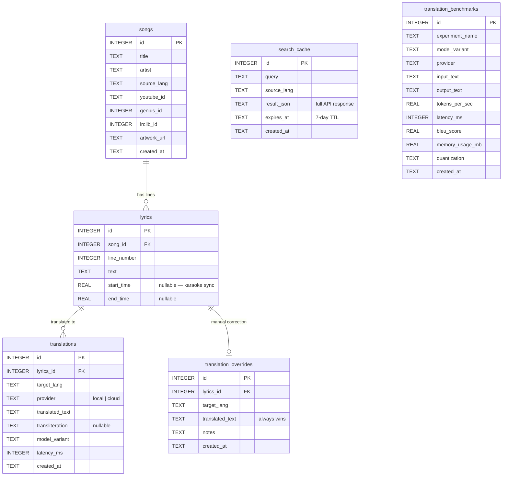
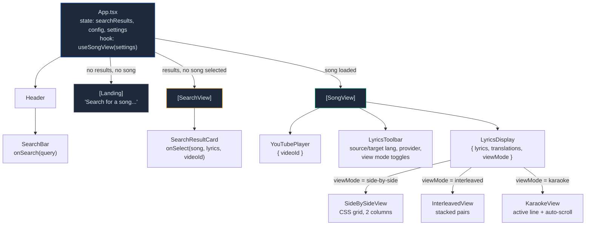
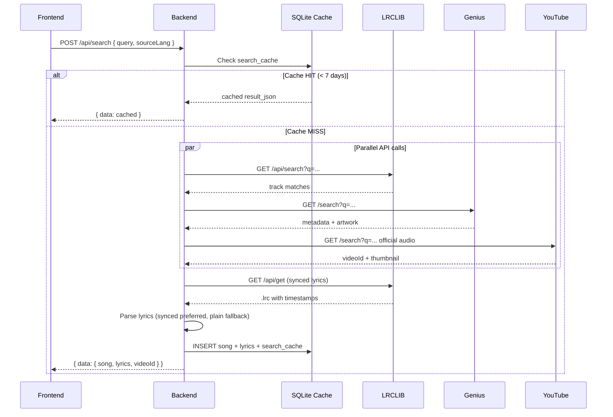
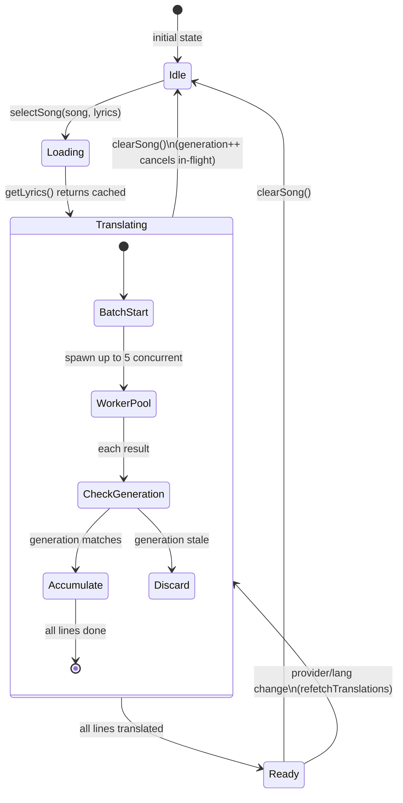

# LyriLearn — Architecture Overview

> Evolving reference for the codebase's structure, data flow, and component relationships.
> Open this file in Cursor's markdown preview (Cmd+Shift+V) to see rendered diagrams.

---

## 1. System Architecture

How the three runtimes communicate:



---

## 2. Translation Priority Chain

The core logic in `apps/server/src/services/translation/index.ts`:



---

## 3. Database Schema

6 tables — the arrows show foreign key relationships:



### Unique Constraints

| Table | Unique Key | Purpose |
|---|---|---|
| `songs` | `(title, artist, source_lang)` | Dedup songs across searches |
| `lyrics` | `(song_id, line_number)` | One text per line position |
| `translations` | `(lyrics_id, target_lang, provider, model_variant)` | Cache key — one translation per line/lang/engine |
| `translation_overrides` | `(lyrics_id, target_lang)` | One override per line/lang (provider-agnostic) |
| `search_cache` | `(query, source_lang)` | One cached result per search |

---

## 4. Frontend Component Tree



---

## 5. Search Flow (POST /api/search)

The most complex backend route — orchestrates 3 external APIs:



---

## 6. Data Flow: useSongView Hook

The frontend brain — manages song state, translation cache, and concurrent translation:



---

## 7. Project File Map

```
lyri-learn/
├── apps/
│   ├── inference/                      Python — MLX inference server
│   │   ├── server.py                     FastAPI, model loading, /translate, /health
│   │   └── requirements.txt              mlx-lm, fastapi, uvicorn
│   │
│   ├── server/                         TypeScript — Hono backend
│   │   ├── src/
│   │   │   ├── index.ts                  App entry, middleware, route mounting
│   │   │   ├── db/
│   │   │   │   ├── schema.sql            6 tables (see §3 above)
│   │   │   │   ├── index.ts              SQLite singleton (WAL, foreign keys)
│   │   │   │   └── init.ts              `bun run db:init` script
│   │   │   ├── routes/
│   │   │   │   ├── search.ts             Song search orchestrator (166 lines)
│   │   │   │   ├── translate.ts          Single-line translation endpoint
│   │   │   │   ├── lyrics.ts             Song lyrics + translations fetch
│   │   │   │   └── config.ts             Provider health/status
│   │   │   └── services/
│   │   │       ├── translation/
│   │   │       │   ├── provider.ts       TranslationProvider interface
│   │   │       │   ├── local.ts          LocalProvider → MLX server
│   │   │       │   ├── cloud.ts          CloudProvider → Google API
│   │   │       │   └── index.ts          Orchestrator (priority chain)
│   │   │       ├── lrclib.ts             LRCLIB client + .lrc parser
│   │   │       ├── genius.ts             Genius API client
│   │   │       └── youtube.ts            YouTube Data API client
│   │   ├── tests/                      ~43 test cases
│   │   └── data/
│   │       └── lyrilearn.db              SQLite file (gitignored)
│   │
│   └── web/                            TypeScript — React frontend
│       ├── src/
│       │   ├── main.tsx                  React 19 entry
│       │   ├── App.tsx                   Root component (169 lines)
│       │   ├── hooks/
│       │   │   ├── useSongView.ts        Song/translation state hook (151 lines)
│       │   │   └── useKaraokeSync.ts     Karaoke time-sync hook
│       │   ├── lib/
│       │   │   ├── api.ts                Backend client (100 lines)
│       │   │   ├── utils.ts              cn() utility
│       │   │   └── transliterate.ts     Client-side transliteration (any-ascii)
│       │   └── components/
│       │       ├── Header.tsx            Sticky top bar
│       │       ├── SearchBar.tsx         Search input + submit
│       │       ├── SearchResultCard.tsx  Song result display
│       │       ├── LyricsDisplay.tsx     Side-by-side / interleaved / karaoke views
│       │       ├── KaraokeView.tsx      Karaoke view with active-line highlight
│       │       ├── LyricsToolbar.tsx     Lang/provider/view toggles
│       │       ├── YouTubePlayer.tsx     YT IFrame API wrapper
│       │       └── ui/                   shadcn/ui primitives
│       │           ├── button.tsx
│       │           ├── input.tsx
│       │           ├── select.tsx
│       │           ├── toggle.tsx
│       │           └── toggle-group.tsx
│       └── tests/                      ~73 test cases
│
├── packages/
│   └── shared/
│       └── types.ts                    All cross-boundary types (116 lines)
│
├── scripts/
│   └── setup-mlx.sh                   MLX + model setup script
│
├── docs/
│   ├── ARCHITECTURE.md                 ← you are here
│   └── plans/
│
└── package.json                        Bun workspace root
```

---

## 8. Phase Roadmap

```mermaid
gantt
    title LyriLearn Build Phases
    dateFormat X
    axisFormat %s

    section Phase 1 — Backend
    Translation engine + providers     :done, p1a, 0, 1
    Search orchestration (3 APIs)      :done, p1b, 0, 1
    SQLite schema + caching            :done, p1c, 0, 1
    Backend test suite (~50 tests)     :done, p1d, 0, 1

    section Phase 2 — Frontend
    React app + shadcn/ui              :done, p2a, 1, 2
    Search → results → song view       :done, p2b, 1, 2
    YouTube player + lyrics display    :done, p2c, 1, 2
    Provider/lang/view toggles         :done, p2d, 1, 2
    Frontend test suite (~36 tests)    :done, p2e, 1, 2

    section Phase 3 — Karaoke
    YT timestamp → active line sync    :done, p3a, 2, 3
    Transliteration toggle             :done, p3b, 2, 3

    section Phase 4 — Flashcards
    IndexedDB storage (idb)            :p4a, 3, 4
    Word selection from lyrics         :p4b, 3, 4
    Spaced repetition review           :p4c, 3, 4

    section Phase 5 — Polish
    Responsive + a11y                  :p5a, 4, 5
    Error boundaries                   :p5b, 4, 5
    Production build + deploy          :p5c, 4, 5
```



---

## 9. Key Numbers

| Metric | Value |
|---|---|
| Total source files | ~49 |
| Total lines of code | ~3,460 |
| Backend test cases | ~43 |
| Frontend test cases | ~73 |
| DB tables | 6 |
| External APIs consumed | 5 (LRCLIB, Genius, YouTube, Google Translate, YT IFrame) |
| Supported languages | 12 (en, ru, ja, ko, es, fr, de, zh, ar, pt, it, hy) |

---

*Last updated: 2026-02-28 — End of Phase 3*
